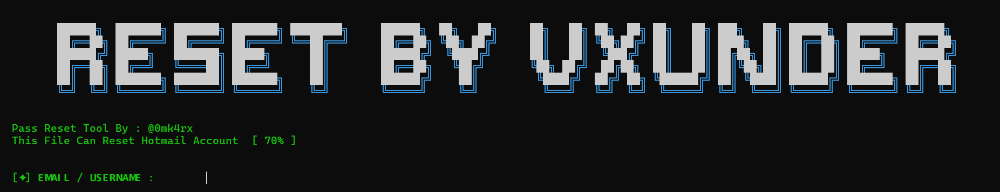

# Jacking
This tool is for **educational and research purposes only**.
## 📸 Tool  Screenshot

## Rest Screenshot

🚀 How to Use the Tool
Follow these steps carefully to set up and use the Instagram Jacking Tool in a controlled and ethical testing environment.

✅ Step 1: Install Required Environment
You can use either Termux or Pydroid on Android:

Download Termux from F-Droid

Or install Pydroid 3 from the Play Store

✅ Step 2: Install Requirements
Navigate to the tool’s directory and install the required Python modules:

bash
Copy
Edit
pip install -r requirements.txt
This installs all dependencies needed for the tool to run.

✅ Step 3: Connect to a VPN
Before using the jacking functionalities, always enable a VPN (for your safety and anonymity). You can use VPN apps like:

PandaVPN

NordVPN

Any VPN of your choice

⚠️ VPN is highly recommended to avoid leaking your real IP during testing.

✅ Step 4: Set Up Telegram Bot for Notifications
To receive real-time updates or captured data through Telegram:

Go to Telegram and search for @BotFather

Create a new bot and copy the Bot Token

Get your Chat ID by starting a conversation with the bot and using the Telegram API

Update your configuration in the tool with:

BOT_TOKEN

CHAT_ID

The tool uses this setup to send login/session updates directly to your Telegram.

✅ Step 5: Run the Jacking Tool
Now you can run the main script to begin the jacking simulation:

bash
Copy
Edit
python3 jacking.py
It will start capturing session or credential information and forward it to your Telegram.

🔁 Password Reset (Optional Feature)
The tool also includes a password reset simulation feature. To use it:

bash
Copy
Edit
python3 reset.py
This simulates the behavior of password reset flows (for educational use only).

